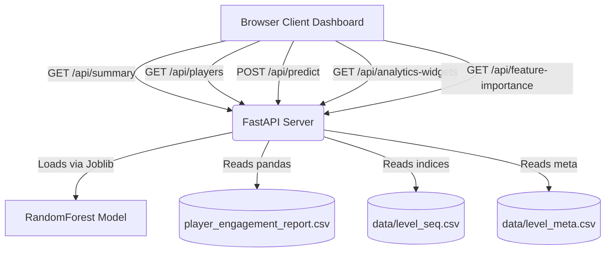

# Player Engagement & Retention Analytics System

A data-driven machine learning analytics platform for game designers to visualize player engagement sequences, map level completion bottlenecks, model retention risks, and dynamically evaluate machine learning churn predictions using a serialized Random Forest classifier.

---

## 🏗️ System Architecture

The project is designed with a decoupled architecture featuring:
1. **Python FastAPI Microservice Backend**: Serves computed KPIs, analytical tables, distribution counts, and runs model predictions.
2. **Interactive Glassmorphic Dashboard Frontend**: Responsive, premium dark-themed UI built with Vanilla HTML/CSS/JS and dynamic charts powered by **ApexCharts**.
3. **Machine Learning Predictor**: Integrates a trained `RandomForestClassifier` to estimate player churn probabilities and recommend personalized retention campaigns.



---

## ⚡ Key Features

* **Real Analytics Dashboard**: Renders 7 dynamically calculated KPIs (Total players, average engagement, average churn probability, playtimes, risk/loyal counts, average success, and restart rates).
* **Player Database Lookup**: Searchable grid displaying players' behavior profiles, completion rates, and AI actions.
* **Chronological Player Timeline**: Merges raw sequencing attempts chronologically to compare user attempt durations against the global average community times.
* **Dynamic AI Insights**: Analyzes individual user success rates, restart counts, and churn scores to compile behavioral diagnostic text and suggestions.
* **ApexCharts Behavior Radar**: Compares a player's behavior (Levels played, success rate, hint rate, retry rate, playtime) against the overall community median benchmark (100).
* **Feature Importance Chart**: Fetches Random Forest model parameters to rank the relative influence of behavior features.
* **Model Comparison & About Pages**: Lists performance stats across validation candidates and outlines business metrics.
* **Report Export**: Direct streaming download of computed customer metrics.

---

## 🛠️ Installation & Dependencies

Ensure you have Python 3.10+ installed. Install the required libraries:

```bash
pip install fastapi uvicorn pandas numpy scikit-learn joblib pydantic requests
```

---

## 🚀 Running the System

### 1. Launch the Backend Server
Run Uvicorn inside the repository directory:
```bash
python -m uvicorn backend.main:app --host 127.0.0.1 --port 8000
```
*The backend will automatically load the dataset files (`data/level_seq.csv`, `data/level_meta.csv`, `model/player_engagement_report.csv`) and initialize the model (`model/player_engagement_model.pkl`).*

### 2. Launch the Frontend Dashboard
Once the server is running, open your web browser and navigate to:
👉 **[http://127.0.0.1:8000](http://127.0.0.1:8000)**

---

## 📊 Deployed Model Information

The system leverages a pre-trained **Random Forest Classifier** with the following specification:
* **Selected Algorithm**: `RandomForestClassifier` (`class_weight='balanced'`, `max_depth=12`, `n_estimators=500`)
* **Input Features (14 Dimensions)**:
  `['LevelsPlayed', 'SuccessfulLevels', 'TotalPlayTime', 'AverageLevelDuration', 'HelpUsed', 'RestartCount', 'SuccessRate', 'HelpRate', 'RestartRate', 'TimePerSuccess', 'AvgLevelPassRate', 'AvgMetaDuration', 'AvgRetryRate', 'AvgWinningDuration']`
* **Performance Benchmark**:
  * Accuracy: **71.26%**
  * ROC-AUC: **0.75** (Best balanced validation profile)

---

## 🔌 API Documentation

| Method | Endpoint | Description | Return Format |
| :--- | :--- | :--- | :--- |
| `GET` | `/api/summary` | Aggregate dashboard stats | `{ total_players: int, avg_engagement_score: float, ... }` |
| `GET` | `/api/players` | Search/Paginate reports database | `{ players: [...], total: int, page: int }` |
| `GET` | `/api/player/{id}` | Individual details, medians & AI insights | `{ profile: {...}, history: [...], community_medians: {...} }` |
| `GET` | `/api/levels` | Hardest level bottleneck parameters | `[ { level_id: int, f_avg_passrate: float, ... } ]` |
| `GET` | `/api/churn-distribution` | Churn probabilities 10% bins counts | `{ labels: [...], counts: [...] }` |
| `GET` | `/api/feature-importance` | Model feature importance scores list | `[ { name: str, importance: float } ]` |
| `GET` | `/api/model-comparison` | Evaluation statistics of algorithms | `[ { name: str, accuracy: float, selected: bool } ]` |
| `GET` | `/api/analytics-widgets` | Loyal/risk players & difficult/restart levels | `{ top_high_risk_players: [...], ... }` |
| `GET` | `/api/export` | Stream download of metrics CSV report | File Stream (`text/csv`) |
| `POST` | `/api/predict` | Score simulated inputs against model | `{ ChurnProbability: float, EngagementScore: float, ... }` |

---

## 🔮 Future Improvements

1. **Auto-Retraining Pipeline**: Establish a cron job or webhook to trigger retraining on new sequence batches using scikit-learn.
2. **Real-time Event Ingestion**: Replace batch file loads with Kafka or RabbitMQ messaging queues to process attempt streams instantly.
3. **Advanced ML Architectures**: Implement Recurrent Neural Networks (LSTM) or Transformer architectures (Attention models) on raw attempts to capture state sequence dependencies.
